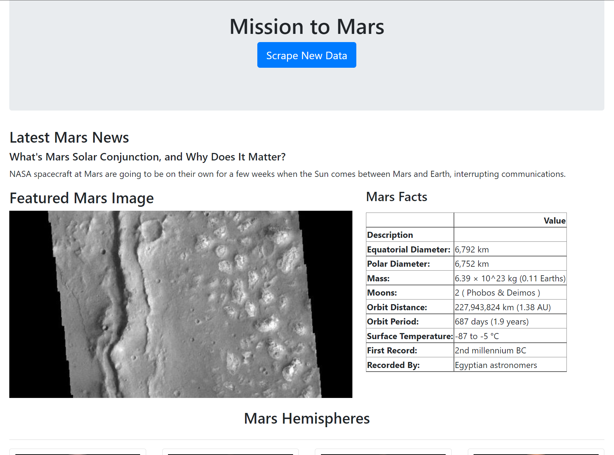
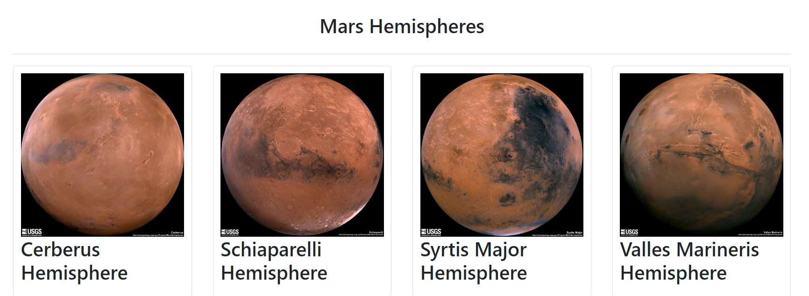

# web-scraping-challenge: Mission to Mars
After building a web scraping application, the obtained Mars-related data was displayed on a new HTML page. 

## Part 1: Building the Web Scraper
The web scraping steps are displayed piecewise in a [Jupyter notebook](Missions_to_Mars/mission_to_mars.ipynb) and as a unified application in a [Python file](Missions_to_Mars/scrape_mars.py). Both versions use `splinter` and `ChromeDriverManager` to open and automate browser actions in Google Chrome. Once a website is loaded in the new browser, `BeautifulSoup` was used to scrape information based on their specific HTML/CSS characteristics. 

In the Python application exclusively, all of the data was compiled into a dictionary for later use.

### NASA Mars News
The latest news title and its corresponding text was scraped from the [Mars News site](https://redplanetscience.com/). 

### JPL Featured Image
The URL for the featured image on the [Mars images site](https:///spaceimages-mars.com/) was scraped. 

### Mars Facts
Using `Pandas`, a table of Mars facts was scraped from the [galaxy facts site](https://galaxyfacts-mars.com/). The entire table was saved in HTML format for ease of use later. 

### Mars Hemispheres
Both the hemisphere names and their corresponding image URLs were scraped from the [Mars hemispheres site](https://marshemispheres.com/). 

Because the full size images could only be accessed by adjusting the URL with each hemisphere name, all of the hemispheres needed to be scraped and isolated from the rest of their text line. Once the names were isolated, each hemisphere's URL could be accessed and its image URL scraped. 

## Part 2: Flask Application
In another [Python applicaiton](Missions_to_Mars/app.py), a `Flask` application was created to connect to a MongoDB collection and display its contents based on an HTML [template](Missions_to_Mars/templates/index.html). 

The scraper (route "/scrape") is activated when the "Scrape New Data" button gets pressed. This uses the [scraper application's](Missions_to_Mars/scrape_mars.py) scrape function to create the mars data dictionary referenced in Part 1 and uploads it to the MongoDB database "mars_app". Each time the button is clicked, the data gets rewritten. After all the data is scraped, the page redirects to the home page.

On the home page (route "/"), the data stored in MongoDB is displayed. An example of the home page (after the scraper has been run) is shown below. 

